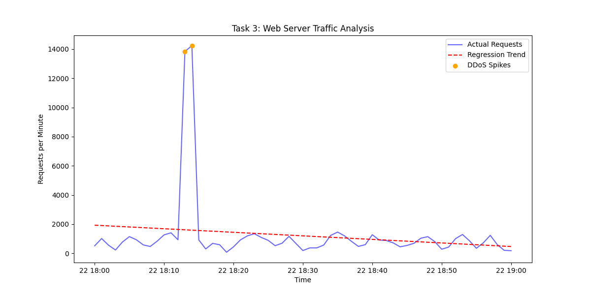

# Task 3: DDoS Detection using Linear Regression

## 1. Objective
The goal of this task is to analyze web server logs to identify periods of abnormal traffic volume. By applying a **Linear Regression** model, we establish a baseline for expected traffic and flag statistical outliers that represent a Distributed Denial of Service (DDoS) attack.

## 2. Methodology
The analysis followed a structured pipeline:
1. **Data Acquisition**: Logs were fetched from the specified server.
2. **Preprocessing**: Timestamps were parsed using `pandas` with mixed-format handling to ensure compatibility.
3. **Resampling**: Data was aggregated into 1-minute intervals to calculate request density.
4. **Regression**: A Linear Regression model was fitted to the time-series data to calculate a trend line ($y = mx + b$).
5. **Detection**: Any traffic spike exceeding **3x the predicted trend** was classified as a DDoS event.

---

## 3. Analysis Results
The regression analysis successfully identified the following high-intensity attack intervals:

**Detected Attack Timestamps:**
* 2024-03-22 18:13:00	~13,800
* 2024-03-22 18:14:00	~14,200

---

## 4. Visual Evidence
The chart below shows the relationship between actual server requests and the calculated regression trend. The orange points represent the detected anomalies.

*Figure 1: Server traffic vs. Linear Trend. Spikes above the threshold indicate the DDoS attack.*

---

## 5. Conclusion
By using regression rather than a simple static threshold, the system adapts to the general growth of traffic over time. This method is highly effective for identifying sudden volumetric attacks that deviate from established patterns.
